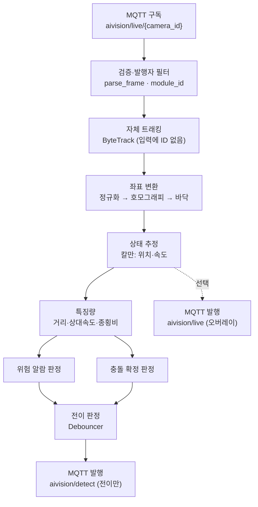

# CV 기반 AMR-사람 충돌 위험 알람·판독 플러그인 기획안 (v2)

## 0. 개정 배경

플랫폼 플러그인 계약(「플러그인 만들기」)에 맞춰 v1을 개정한다. 핵심 변화는 이 모듈이 독립 인터페이스를 갖는 별도 시스템이 아니라 **계약을 지키는 규칙형 플러그인**이라는 점이다. 검출을 스스로 하지 않고 이미 발행된 박스를 받아 판정만 하며, 입력·출력·설정이 전부 계약(등록·일감·MQTT·heartbeat)을 통한다.

v1 대비 확정된 두 가지:

- 계약의 박스는 `{x1,y1,x2,y2,label,score}` 뿐이고 `track_id`가 없다. → **트래킹은 이 모듈의 몫**으로 확정(v1에서 열려 있던 질문이 닫힘).
- 입력이 곧 계약 3장의 "남이 낸 박스 받아 쓰기"다. → 이 모듈은 영상을 다시 추론하지 않고 `aivision/live`를 구독한다.

## 1. 플러그인 성격

- 종류: 규칙형(rule-based). 같은 프레임을 다시 추론하지 않는다.
- `id`: `collision`
- `kind`: `sidecar` (자체 컨테이너로 코어 옆에서 돈다)
- 코어는 이 플러그인의 존재를 모른다. 지워도 코어는 그대로 돈다.

## 2. 계약 매핑 — 네 가지 일

### 2.1 등록

```
POST /api/modules
{
  "id": "collision",
  "name": "충돌 위험",
  "kind": "sidecar",
  "description": "AMR 과 사람의 접근·충돌을 본다",
  "capabilities": ["COLLISION_RISK", "COLLISION"],
  "endpoint": "http://localhost:12010"
}
```

같은 `id` 재호출은 갱신이므로 재시작에 안전하다. `capabilities`는 선언일 뿐이다(계약 7장). `COLLISION_RISK`, `COLLISION` 두 탐지 항목을 **플랫폼에 사람이 먼저 만들어 두어야** 발행이 연결된다. 배포 전 선결 조건이다.

### 2.2 일감 받기

`GET /api/modules/collision/work`를 20초마다 물어 담당 카메라를 받는다. 카메라마다 그 카메라의 `aivision/live/{camera_id}`를 구독한다. 빈 목록이면 조용히 기다린다. 이 모듈은 RTSP를 판정에 쓰지 않으므로 `rtsp`는 증거 저장(선택, 7장) 외에는 무시하고 `camera_id`만 쓴다.

### 2.3 발행 — detect(전이만) / live(선택)

판정 결과는 MQTT로 낸다. **detect는 상태가 바뀌는 순간만** 낸다. 사람이 위험 구역에 머무는 동안 매 프레임 내면 DB가 무너진다. 전이 판정은 SDK `Debouncer`로 한다.

위험 알람:

```
토픽 aivision/detect/{camera_id}/collision
{ "camera_id":1, "module_id":"collision",
  "item":"COLLISION_RISK", "state":"active",
  "ts":"...", "confidence":0.9,
  "boxes":[ 위험 사람·AMR 박스 ],
  "level":"imminent" }          // 주의/임박은 payload 로 구분
```

실제 충돌:

```
{ "item":"COLLISION", "state":"active", ...,
  "grade":"knockdown", "v_rel":1.2 }
```

실시간 시각화가 필요하면 위험 구역·대상 박스를 `aivision/live/{camera_id}`로 낸다(선택). 이건 쌓이지 않고 화면용이다.

### 2.4 생존 신고

`POST /api/modules/collision/heartbeat` 30초. 90초 넘기면 화면에 응답 없음.

## 3. 입력 — 남이 낸 박스 받아 쓰기 (계약 3장)

이 모듈의 입력은 오직 `aivision/live`다.

- **박스에 track_id 가 없다.** 따라서 트래킹은 이 모듈의 몫이다(5.1).
- **좌표는 0~1 정규화.** 프레임 크기를 모르므로 픽셀로 환산하지 않는다. 호모그래피도 정규화 좌표를 그대로 입력으로 삼는다(5.2).
- **라벨을 코드에 박지 않는다.** AMR·사람 라벨(`"자율주행로봇"`, `"Human"` 등)은 화면에서 바뀔 수 있으므로 설정으로 받는다.
- **발행자를 거른다.** 같은 토픽에 여러 발행자가 낸다. `module_id`로 AMR 검출기·사람 검출기만 취하고 자기 출력은 먹지 않는다.
- **받은 것을 믿지 않는다.** 모양이 다르면 버린다(`parse_frame`). 남의 버그로 죽지 않는다.
- **짝짓기는 도착 시각으로.** 발행자 `ts`는 초 단위·다른 시계다. 사람 박스와 AMR 박스를 같은 순간으로 묶으려면 `Frame.received`(도착 시각)를 쓴다. 이는 7장의 동시성 창(Δt) 판정에 직접 영향한다.
- **콜백에서 일하지 않는다.** MQTT 콜백은 받은 박스를 버퍼에 넣기만 하고, 판정은 자기 스레드 루프에서 돈다.

## 4. 처리 파이프라인



카메라마다 독립 파이프라인이다(카메라별 호모그래피·트래커 상태·구독).

## 5. 단계별 알고리즘

### 5.1 자체 트래킹

입력 박스에 ID가 없으므로 ByteTrack 등으로 정규화 박스에 ID를 부여해 시계열을 만든다. 발행자(YOLO)는 프레임 단위라 시계열이 없고, 그 연속성을 여기서 공급한다.

### 5.2 좌표 변환 (호모그래피)

발 접지점 = 박스 하단 중앙 `((x1+x2)/2, y2)`. 정규화 좌표 그대로 호모그래피 `H`에 넣어 바닥 월드 좌표를 얻는다. **H를 정규화 이미지 좌표계에서 캘리브레이션**하면 프레임 크기를 몰라도 된다(계약의 정규화 원칙과 정합). H는 카메라별 설정으로 플러그인이 보관하며, 자기 화면에서 스냅샷 위 4점으로 잡는다(6장).

### 5.3 상태 추정 (칼만)

트랙별 칼만으로 월드 위치·속도를 얻는다. `max_age`로 검출 gap·가림 순간 트랙을 유지한다.

### 5.4 특징량

사람×AMR 쌍별: 바닥 투영 거리, 상대속도 `v_rel`, 최근접 거리·시각(TTC 보조), 종횡비 `w/h`, 종횡비·속력 변화.

## 6. 위험 알람

비대칭 설계 유지: AMR 관측 속도 전방 스윕 vs 사람 최악 도달 반경 `R_h(τ)=r_h+σ+v_h,max·τ`. 2단계.

| 레벨 | 조건 | 발행 |
|---|---|---|
| 주의 | 사람이 AMR corridor 내부 | COLLISION_RISK active, level=warn |
| 임박 | 전방 스윕이 사람 도달 영역 도달 | COLLISION_RISK active, level=imminent |

전이(active↔inactive)만 detect로 내고 Debouncer로 떨림을 막는다. 일방향 순환 현장에서는 각 스테이션의 AMR 접근 방향이 고정이라 오알람 튜닝이 단순해진다.

## 7. 실제 충돌 판독

텔레메트리 없이 AMR 박스 움직임으로 충격을 관측한다.

```
접촉 = 바닥 투영 거리 ≤ ε
충격 = (AMR 급정지 Δ|v_amr|) ∨ (사람 Δv 스파이크) ∨ (전도: 종횡비 반전)
확정 = 접촉 ∧ 충격,  단 도착 시각 기준 Δt 창 내 동시
```

확정 시 COLLISION active(grade, v_rel을 payload로). 등급은 v1과 동일(접촉·스침 / 충돌·전도 / 심각).

증거: 박스만으로 판정이 끝나므로 영상은 열지 않는다. 증거가 필요하면 확정 순간 `GET /api/stream/{camera_id}/snapshot.jpg` 한 장이 가장 가볍다. 전후 클립이 필요하면 work의 `rtsp`를 확정 시에만 잠깐 열어 녹화한다(선택, 추론이 아닌 녹화용).

주의: 발행자 `ts`가 초 단위라 100ms 충격의 정밀 시각 정합엔 한계가 있다. 순간값 대신 접근 → 소실/전도 → 정지 시퀀스로 판정하는 v1 원칙이 여기서 더 중요해진다.

## 8. 자기 화면·설정 (계약 4장)

플러그인이 자기 웹 UI를 띄우고 코어는 `endpoint`를 iframe으로 감싼다.

- 호모그래피 4점 캘리브레이션: `GET /api/stream/{camera_id}/snapshot.jpg` 위에 점을 찍는다.
- 위험 구역·경로 주석, 임계값(ε, Δt, T, v_h,max), 라벨 매핑, 출력 항목 매핑(`GET /api/solutions` 드롭다운).
- 담당 카메라는 `GET /api/modules/collision/work`, 전체는 `GET /api/cameras`.
- 설정은 플러그인이 보관한다(자기 볼륨, 예: `/config/collision.json`). 코어에 저장하지 않는다.
- 플랫폼이 안 보여도 화면은 빈 목록으로 내려앉고 죽지 않는다.

## 9. 배포 (계약 5장)

```yaml
  mod-collision:
    build:
      context: ../modules
      dockerfile: collision/Dockerfile
    ports:
      - "${COLLISION_UI_PORT:-12010}:8000"
    restart: unless-stopped
    depends_on:
      base-app: { condition: service_started }
      base-broker: { condition: service_started }
    volumes:
      - collision-config:/config
    environment:
      PLATFORM_URL: http://base-app:8000
      MQTT_HOST: base-broker
      MQTT_PORT: "1883"
      MODULE_ID: collision
      MODULE_NAME: 충돌 위험
      PUBLIC_URL: ${COLLISION_PUBLIC_URL:-http://localhost:12010}
      SRC_MODULES: "yolo-server,camera-meta"   # 구독할 발행자
      AMR_LABEL: "자율주행로봇"
      PERSON_LABEL: "Human"
```

컨테이너 안에서는 `base-app`·`base-broker`, 브라우저가 보는 `PUBLIC_URL`은 호스트 주소. 라벨·구독 발행자는 환경변수로 받아 코드에 박지 않는다(3장).

## 10. 한계

CV 단독(v1) + 계약에서 온 제약.

- 가림: 독립 채널(텔레메트리)이 없어 "AMR 근접 소실 + 급정지"는 확정이 아닌 정황.
- 단안 깊이: 전도 순간 발 접지 붕괴 → 순간값 불신, 근본 해법은 다중 카메라.
- 프레임레이트·초 단위 ts: 정밀 시각 정합 한계 → 시퀀스 판정으로 보완.
- 입력에 ID 없음 → 자체 트래킹 부담.
- 항목 사전 생성 필요, 인증·계약 버전 없음(계약 7장 부채) → 사내망 전제.

## 11. 붙이기 전 점검 (계약 6장 + 충돌 고유)

```
[ ] 등록·heartbeat OK
[ ] work 로 카메라 할당 반영, 빼면 멈춘다
[ ] live 구독 시 module_id 로 발행자 필터, 자기 출력 안 먹는다
[ ] 잘못된 박스는 버린다 (parse_frame)
[ ] 박스 좌표 0~1, label 사람이 읽을 이름
[ ] detect 는 전이 순간만 (머무는 동안 반복 없음)
[ ] Δt 짝짓기에 도착 시각(Frame.received) 사용
[ ] 콜백은 버퍼링만, 판정은 자기 스레드
[ ] 호모그래피·설정을 자기 볼륨에 보관, 코어에 안 넣는다
[ ] 플랫폼·브로커 내려도 안 죽는다 (재연결 대기)
[ ] COLLISION_RISK·COLLISION 항목이 플랫폼에 존재한다
[ ] endpoint 를 브라우저에서 직접 열면 화면이 뜬다
```

## 12. 개발 단계

1. **계약 골격**: 등록·work·heartbeat·live 구독·검증·발행자 필터. detect 없이 로그만.
2. **알람**: 트래킹·호모그래피·칼만·스윕 → COLLISION_RISK 전이 발행. 자기 UI 캘리브레이션.
3. **판독**: 충돌 확정·등급·COLLISION 발행·스냅샷 증거.
4. **(범위 밖)** 다중 카메라 3D, FMS 텔레메트리 독립 채널, VLM 경위 판독.
