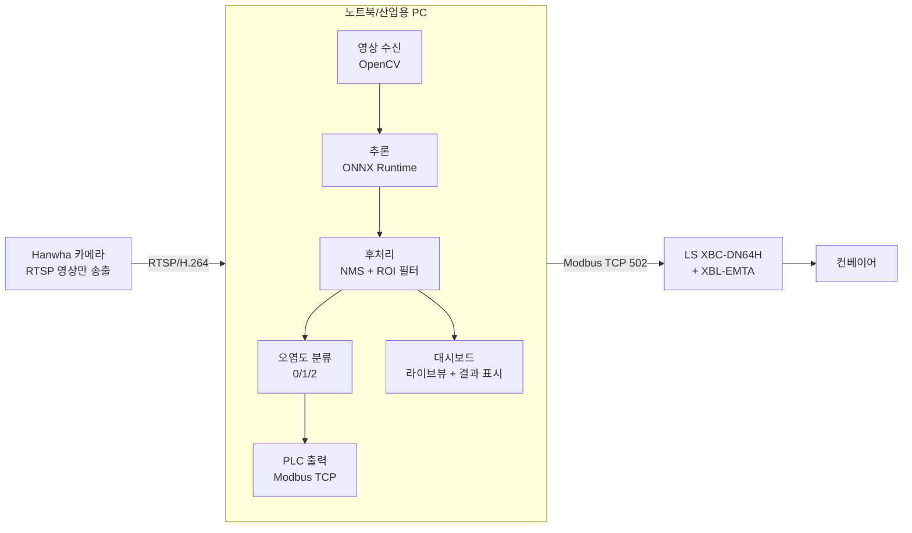

# 아이에스에코솔루션 부적합(쓰레기) 탐지 — PC 추론 방식 애플리케이션 기획서

작성일: 2026-07-22 · 대상 사이트: 아이에스에코솔루션(컨베이어 부적합 탐지) · 버전: v0.1 (MVP)

---

## 1. 배경 및 결정

- 제공받은 모델을 카메라 NPU에 올리면 **양자화가 붕괴**하여 confidence가 0 / 100 양극단으로만 튀는 현상이 지속됨. 온디바이스(카메라 내장 앱) 추론으로는 정상 동작 확보가 불투명함.
- **결정: 추론 위치를 카메라에서 PC로 이관한다.**
  - 카메라는 **영상만** PC로 전송(RTSP).
  - PC가 `best_trash.onnx`(또는 `best_trash.torchscript.pt`)로 추론.
  - PC가 결과 코드를 **PLC로 직접 전송**(PC ↔ PLC 이더넷 직결).
- 검수/시연 시 대시보드를 띄워 설명하려면 PC는 어차피 상시 연결되어 있음. 외부 관찰자 시점에서 추론이 카메라 내부에서 도는지 PC에서 도는지 구분되지 않으므로, 이관에 따른 시연상 문제는 없음.
- 쓰레기 모델 자체의 근본 개선(양자화 안정화)은 별도 트랙으로 시간을 두고 진행한다. 본 기획서 범위 밖.

> 참고: 결과 산출·분류·PLC 통신 로직은 기존 카메라 앱 `daim_detector`에서 이미 현장 검증된 코드가 존재함. **신규 구현이 아니라 검증된 로직의 Python 포팅**으로 접근하여 개발 속도를 확보한다.

---

## 2. 시스템 아키텍처

핵심: 카메라는 dumb sensor(영상 소스)로만 사용. 판단·제어의 두뇌는 전부 PC 애플리케이션에 위치.

---

## 3. 필수 기능 (MVP 범위)

속도 우선. 아래 6개만 구현하고 나머지는 4장에서 명시적으로 제외한다.

### F1. 영상 수신
- 카메라 RTSP 스트림 수신(OpenCV `VideoCapture`).
- 프레임 드랍 허용(최신 프레임 우선). 실시간성 > 무손실.

### F2. 추론
- 1순위: `best_trash.onnx` + **ONNX Runtime** (CPU/GPU). yolov7 레포 의존 없음, 배포 단순.
- 대체: `best_trash.torchscript.pt` + `torch.jit.load()` 한 줄 로드. ONNX 경로에 문제 발생 시 즉시 교체 가능하도록 로더를 추상화(공통 인터페이스 `infer(frame) -> boxes`).
- 라벨 통일(4개 물체 → `trash`)은 제공된 모델 파일에 이미 반영되어 있음(nc=1, 단일 클래스 출력). 앱은 단일 클래스로 처리.

### F3. 후처리
- 출력 텐서에서 박스 추출 → confidence threshold → **NMS**.
- ROI(관심영역) 필터: 컨베이어 영역 밖 오탐 제거(폴리곤 point-in-polygon). 좌표는 설정값으로 관리.
- **[최초 통합 시 반드시 확인]** ONNX 출력이 이미 디코딩된 박스(`[1, 25200, 6]` = x,y,w,h,obj,cls)인지, raw logit인지 첫 실행에서 shape/값으로 검증.
  - 디코딩 완료 상태(표준 YOLOv7 export 기본값) → **NMS만** 수행.
  - raw logit 상태 → 카메라 앱의 sigmoid + anchor decode 로직을 그대로 포팅.

### F4. 오염도 분류 (결과 코드 산출)
기존 `daim_detector`의 검증된 로직을 그대로 이식:
- **2초 sliding window**로 프레임 흔들림 흡수 → 윈도우 내 `max(count)`, `max(area_ratio)` 사용.
- count 레벨(L/M/H) × area 레벨(L/M/H)을 각각 임계값으로 판정 후 `severity = max(count_level, area_level)`로 단일 코드 축약.
- cooldown 타이머 + 카테고리 변경 시 cooldown 우회(위협 수준 변화는 즉시 반영).

| 결과 코드 | 의미 | 판정 |
|:---:|:---|:---|
| 0 | 정상 | count·area 모두 L (L_L) |
| 1 | 부분오염 | 하나라도 M, H 없음 |
| 2 | 많이오염 | 하나라도 H |

### F5. PLC 출력
- PC → PLC **Modbus TCP(502)** 직결. 파이썬은 `pymodbus`.
- IF 맵은 기존 규격 유지(5장). PC가 `D8100`(PC Ready)·`D8101`(결과 코드) 기록.
- `D8000`(PLC Ready)·`D8001`(Conveyor RUN) 읽어 게이트 조건으로 사용(옵션, 필요 시).

### F6. 대시보드 (시연/검수용)
- 라이브 영상 + 탐지 박스 오버레이 + 현재 결과 코드(정상/부분오염/많이오염) + PLC 연결 상태.
- 구현: **FastAPI + 브라우저(localhost)** — 기존 대시보드/MoTo 스택(FastAPI)과 정합, MJPEG 스트리밍으로 간단히 라이브뷰 제공.
- 화면에는 판정 결과와 PLC 반영 여부가 실시간으로 보이도록 하여, 검수 시 "탐지 → 신호 전달"이 눈으로 확인되게 함.

---

## 4. 제외 범위 (의도적으로 뺌 — 속도 우선)

PC 방식에서는 불필요하거나 시연 필수요건이 아니므로 MVP에서 제외:

- SUNAPI / IVA 영역 SUNAPI 연동 (ROI는 앱 설정값으로 대체)
- MQTT publish (본 사이트는 PLC 직접 제어가 목적)
- 이벤트 이미지 갤러리·순환 저장
- self-restart / NPU 누수 우회 로직 (PC엔 해당 없음)
- 카메라 rule engine / ONVIF metadata / OSD
- 모델 화이트리스트·모델 스위칭 UI (단일 모델 고정)

---

## 5. 인터페이스 규격 (PLC IF 맵)

기존 `daim_detector` 운용 컨벤션 유지.

| 방향 | 디바이스 | 이름 | 값 | 비고 |
|:---:|:---:|:---|:---|:---|
| PC ← PLC (read) | D8000 | PLC Ready | 0/1 | 게이트 조건(옵션) |
| PC ← PLC (read) | D8001 | Conveyor RUN | 0/1 | 게이트 조건(옵션) |
| PC → PLC (write) | D8100 | PC Ready | 0/1 | 앱 기동/정지 신호 |
| PC → PLC (write) | D8101 | 결과 코드 | 0/1/2 | 정상/부분오염/많이오염 |

- Modbus 레지스터 실주소(D8100/D8101 → Modbus 주소) 변환은 **벤더 제공 Modbus 매핑표(LS h-prefix hex 표기)** 기준으로 확정.
- 대체 프로토콜: XGT 전용 프로토콜(TCP 2004)도 가능(카메라 앱에 검증된 wire 구현 존재). Modbus 경로에 문제 시 fallback.

---

## 6. 기술 스택

| 구분 | 선택 | 비고 |
|:---|:---|:---|
| 언어 | Python 3.x | |
| 영상 | OpenCV (RTSP) | |
| 추론 | ONNX Runtime (1순위) / PyTorch TorchScript (대체) | 로더 추상화 |
| PLC | pymodbus (Modbus TCP) | XGT fallback |
| 대시보드 | FastAPI + 브라우저(MJPEG) | 기존 스택 정합 |
| 배포 | 단일 PC 실행 (venv 또는 PyInstaller 패키징) | |

---

## 7. 개발 단계 / 우선순위

빠른 순서로 세로 슬라이스를 먼저 관통시킨 뒤 정교화.

1. **파이프라인 관통(1차)**: RTSP 수신 → ONNX 추론 → 박스 출력을 콘솔/창에 표시. (F1~F3 최소)
2. **PLC 연동**: 더미 결과 코드(0/1/2)를 D8101에 기록 → PLC read-back으로 왕복 검증. (F5)
3. **분류 로직 이식**: 카메라 앱의 sliding window + 9매트릭스 + cooldown 포팅 → 실제 코드 산출. (F4)
4. **대시보드**: 라이브뷰 + 결과/상태 표시. (F6)
5. **ROI·임계값 튜닝 + 시연 리허설**: 현장 조명/각도 기준으로 threshold·cooldown 조정.

---

## 8. 착수 전 확인 필요 사항

1. **모델 출력 형태**: `best_trash.onnx`의 출력이 디코딩 완료 박스인지 raw logit인지 → F3 후처리 분량 결정.
2. **PLC 프로토콜 확정**: Modbus TCP로 진행 여부(벤더 매핑표 최신본 확보) vs XGT.
3. **대시보드 형태**: FastAPI+브라우저(권장) vs 데스크톱 GUI 중 선택.
